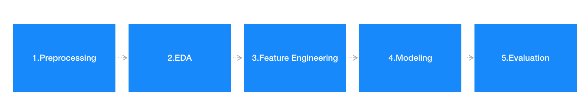
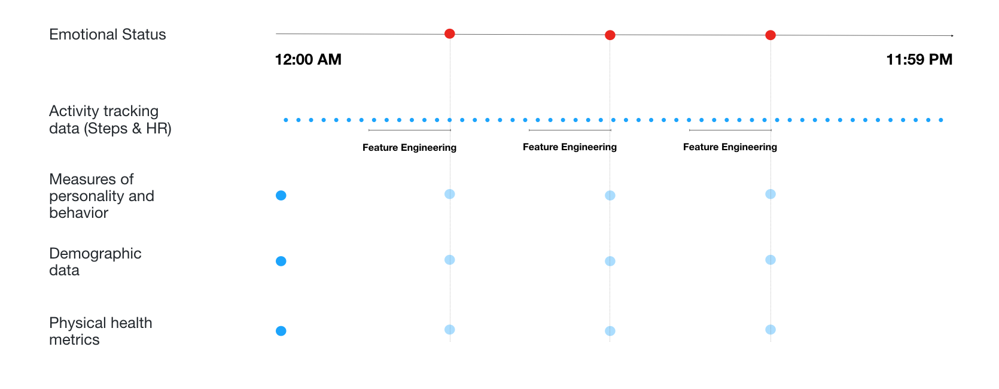
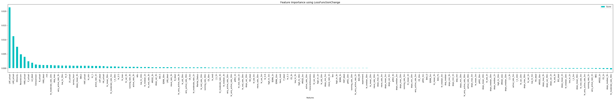

# Emotional-Status-with-Wearable-Data

*I use this repo to demonstrate my data science technical capability to recruiters. To avoid confusion, I have only included code, plots, graphs, and conclusions from my work. For more information, please email sicong.zhao@duke.edu*

### Table of Contents

+ [**Introduction**](#introduction)
+ [**Methods**](#method)
+ [**Data Description**](#data)
+ [**Exploratory Data Analysis**](#EDA)
+ [**Feature Engineering**](#feature)
+ [**Modeling**](#model)
+ [**Evaluation**](#evaluation)
+ [**Conclusions**](#conclusion)

<h2 id="introduction">1.Introduction</h2>

This project examines if emotional states can be reliably recognized from data derived from a commercially available wearable fitness tracker and additional indicators including neuroimaging, personality, and demographic data. 

In this project, we have studied two type of labels constructed under the idea of the circumplex model of emotion. 

Label 1: Positive/Negative Emotion
$$
\text{Positive/Negative Emotion} = \begin{cases} 
1, &\max(la\_n,n,ha\_n) \geq \max(la\_p,p,ha\_p) \\
0, & \text{otherwise}
\end{cases}
$$
Label 2: Relative Emotion
$$
\begin{align}
\text{Valence} &= \text{mean}(la\_n,n,ha\_n) - \text{mean}(la\_p,p,ha\_p) \\
\\
\text{Relative Emotion} &= \begin{cases} 
1, &\text{Valence} \geq \text{Median}(\text{Valence}) \\
0, & \text{otherwise}
\end{cases}
\end{align}
$$

**1) Prediction for Label1: Positive/Negative Emotion **

Table 1 shows the performance evaluation of the best models for predicting **Positive Negative Emotion.** As a comparison, the precision for random guessing is 0.273.

|      | Scenario      | Data                            | Sampling Methods                     | Recall | Precision | F1    |
| ---- | ------------- | ------------------------------- | ------------------------------------ | ------ | --------- | ----- |
| 1    | Current Users | Fitbit                          | SMOTE                                | 0.550  | 0.347     | 0.425 |
| 2    | New Users     | Fitbit                          | Assign Class Weight to Loss Function | 0.419  | 0.228     | 0.295 |
| 3    | Current Users | All Data (See Data Description) | Assign Class Weight to Loss Function | 0.626  | 0.482     | 0.544 |
| 4    | New Users     | All Data                        | SMOTE                                | 0.870  | 0.260     | 0.399 |

***Table1***. *Summary of the best models for predicting Positive/Negative Emotion*

As shown in table 1, the model that gives the highest F1 score is the one predicting positive/negative emotion for current users using all data with class weight assignment. It has achieved an F1 score to be 0.544, and a precision to be 0.482, improved by 76.6% than random guesses. In order to understand each feature's influence on the prediction, we investigated the Shapley value of each feature in this model (see figure 6). The goal of Shapley value is to explain the prediction of an instance x by computing the contribution of each feature to the prediction.

***Fig1***. *The Shapley Values of the features from the best model that predict positive/negative emotion.* *There are 3 things which help you understand figure 6: (1) Each row represents a feature. (2) The color indicates relative value for each feature. blue represents relative lower value, red represents relative higher value. (3) The value on the axis at the bottom represents the influence on the output value, which is the probability that a subject is unhappy.*

Conclusions from table 1 and figure 1:

1. Using additional data (psychological, demographic data, physical health data) helps improve the prediction. In both scenarios, models trained with all data give better performance. F1 score improved by 0.119 and 0.104 for current users and new users respectively.
2. The precision of prediction for new users is lower than the precision of random guesses.Psychological data are very important. 
3. The 3 most important features are: 
   * recent emotional states (LAP_actual, LAN_actual, P_actual, HAP_actual)
   * Age
   * Neuroticism

**2) Prediction for Label2: Relative Emotion**

Table 2 shows the performance evaluation of the best models for predicting **relative emotion**  As a comparison, the precision for random guessing is 0.564.

|      | Scenario      | Data                            | Sampling Methods | Recall | Precision | F1    |
| ---- | ------------- | ------------------------------- | ---------------- | ------ | --------- | ----- |
| 1    | Current Users | Fitbit                          | -                | 0.578  | 0.617     | 0.596 |
| 2    | New Users     | Fitbit                          | -                | 0.699  | 0.558     | 0.617 |
| 3    | Current Users | All Data (See Data Description) | -                | 0.877  | 0.590     | 0.705 |
| 4    | New Users     | All Data                        | -                | 0.959  | 0.555     | 0.703 |

***Table2.*** *Summary of best models for predicting Relative Emotion*

As shown in table 2, the model that gives the highest F1 score is the one predicting relative valence for current users using all data with class weight assignment. It has achieved an F1 score to be 0.705, and a precision to be 0.590, improved by 4.6% than random guesses. In order to understand each feature's influence on the prediction, we investigated the Shapley value of each feature in this model (see figure 2).

***Fig2***. *The Shapley Values of the features from the best model that predict relative emotion.*

There are three findings from table 4 and figure 7.

1. Using additional data (psychological, demographic data, physical health data) does help improve the prediction. In both scenarios, models trained with all data give better performance. F1 score improved by 0.109 and 0.086 for current users and new users respectively.
2. The precision of prediction for new users is lower than the precision of random guesses.Fitbit data are very important. 
3. The top 10 most important features are all engineered from Fitbit data which represents the regulatory activity of heart rate or activity level.

The contributors of this project:

* **Mikella Green**: Data providor, Neuroscience expert
* **Joaquin Menendez**: Data Pre-processing, EDA
* **Sicong Zhao**: EDA, Feature Engineering, Modeling, Data Quality Checking

<h2 id="method">2.Methods</h2>

We followed the traditional data science workflow as shown below. Let me break things down.

**Step1. Pre-processing**

My teammate, Joaquin did most of the work, extracted and organized data points from the original database generated in two experiments from Motivated Cognition and Aging Brain lab in Duke Psychology & Neuroscience department. I checked the data correctness, detected and fixed the scale inconsistency issue for 27 variables.

More details in [**Data Quality Summary**](https://github.com/RyC37/Emotional-Status-with-Wearable-Data/blob/master/1-EDA/%5BReport%5D%20Data%20Quality%20Summary.pdf)

**Step2. EDA** 

I looked into the distributions of emotional states, emotional score distribution by age group, PCA analysis, and KMeans analysis. This step helped us gain a deeper understanding of the data at hand, and resolved the puzzle in terms of which method to use to decide if a subject is happy/unhappy.

More details in [**Exploratory Data Analysis**](#EDA) section.

**Step3. Feature Engineering**

I generated 3 types of features based on others' research and my ideas:

* Heart rate related features
* Steps related features
* Survey related features

More details in [**Feature Engineering**](#feature) section

**Step4. Modeling**

To achieve the best possible precision, I have attacked this problem both in regression and classification approaches. In classification cases, I combined three sampling technologies (upsample minority class, SMOTE, change class weight) to account for the imbalanced dataset due to the positivity bias (people tend to claim they are happy). 
The models I used include CatBoost, XGBoost, Random Forest, Lasso, Ridge, SVM. And CatBoost outperforms than all other models in each scenario.

More detail in [**Modeling**](#model) section.

**Step5. Evaluation**

For regression models, I turned the results into binary results (happy/unhappy). Then evaluated key metrics (F1, recall, precision) using models trained by cross-validation running on a held-out validation set.

More detail in [**Evaluation**](#evaluation) section.

<h2 id="data">3.Data Description</h2>

The data is collected from over 150 participants over 10 days in the Motivated Cognition and Aging Brain lab in Duke Psychology & Neuroscience department, which contains:

| Feature                                                | Frequency                   |
| ------------------------------------------------------ | --------------------------- |
| Measures of personality and behavior                   | 3 times per day per subject |
| Demographic data                                       | one-time measurement        |
| Physical health metrics                                | one-time measurement        |
| Activity tracking data (Steps, Heart Rate form Fitbit) | sum per minute              |
| Functional brain connectivity                          | one-time measurement        |

The data is confidential for now, so I am not including them in this repo. But after our work being published, the data will become public.

<h2 id="eda">4.Exploratory Data Analysis</h2>

In EDA, I scrutinized the following:

* Distribution & Correlation of Labels (Emotional States Measures)
* Relationships between Labels
* Compare the Emotional States by Subjects - check how emotional states vary across subjects
* Valence by Age
* PCA Analysis of Labels
* Emotional States Transformation Analysis
* Emotional States Transformation by Age group

More details in [**Exploratory Data Analysis Report**](https://github.com/RyC37/Emotional-Status-with-Wearable-Data/blob/master/1-EDA/%5BReport%5D%20Exploratory%20Data%20Analysis.pdf)

<h2 id="feature">5.Feature Engineering</h2>

I have created meaningful features from band data (steps & heart rate by minute) within a certain **period** [5m, 10m, 30m, 1h, 3h] (the concept can be shown in the graph below) before the experience sampling (when we record emotional states of participants). 

Features including basic statistics of heart rate and steps, resting time, activity level and variation of heart rate. Among all these features, the ‘variation of heart rate in the last 30 mins’ performs the best. And there are 13 engineered features in the top 30 important features (measured by ‘Loss Function Change’).

The definition of features generated:

**Steps related features**

- Statistics: max, min, mean, std 
- Move Rate: The # of minutes with step > 0 / total minutes 
- Active Rate: The # of minutes with step > 10 / total minutes 
- Very Active Rate: The # of minutes with step > 20 / total minutes 
- Running Rate: The # of minutes with step > 30 / total minutes

**Heart rate related features**

- Statistics: max, min, mean, std
- Resting Rate: The # of minutes with HR < 30 percentile heart rate > 0 / total minutes
- Moderate Rate: The # of minutes with HR > 50 percentile heart rate > 0 / total minutes
- Very Active Rate: The # of minutes with HR > 80 percentile heart rate > 0 / total minutes
- SDNN: Standard deviation of heartbeat intervals
- pHR2: Percentage of the difference between adjacent HR greater than 2
- rMSSD: Root of mean squared HR change
- Highest HR
- Lowest HR
- l_h: Lowest HR / Highest HR
- CR: Highest HR / Highest HR so far

Code can be found at: [**Feature Engineering Code in Jupyter Notebook**](https://github.com/RyC37/Emotional-Status-with-Wearable-Data/blob/master/Pre-processing-and-feature-engineering.ipynb)

<h2 id="model">6.Modeling</h2>

There are a lot of situations needed to be taken into account. Like the inclusion of features (fitbit only or all features), the scenarios (predict for new users or current users) and different sampling technologies. Therefore, after trying modeling in a lot of [Jupyter notebooks](https://github.com/RyC37/Emotional-Status-with-Wearable-Data/tree/master/3-Model/_Archive), I switched to [a python script](https://github.com/RyC37/Emotional-Status-with-Wearable-Data/blob/master/3-Model/evaluation_tools.py) to control the variables and train models altogether.

We have 1872 observations with 173 features. Given the amount of data we have, the appropriate method types falls into 2 types. Tree based methods and simple models with regularization. 

* For tree based model, we used CatBoost, XGBoost, Random Forest. 
* For simple models with regularization, we used Logistic Regression and Linear Regression with L1, L2 regularization.
* Additionally, we also tried SVM, BaysianRidge as a comparison.

In terms of **hyper parameter tuning**, the initial parameter settings are form my understanding of documentations or others examples. Then I used random grid search and grid search for optimal parameters. 

For **evaluation**, I used cross validation and validate models on held-out set, average the results of F1, recall and precision.

The approaches I have not mentioned before for modeling are as follows:

1. Use random grid search for optimal parameters
2. Use cross validation and validate set to evaluate model performance

The results are as described at [**Introduction**](#introduction).

<h2 id="evaluation">7.Evaluation</h2>

There is [a full list of model evaluation](https://github.com/RyC37/Emotional-Status-with-Wearable-Data/blob/master/4-Results/model_evaluation.csv), which contains all the results I have achieved for now.

In terms of feature importance, here are two plots generated from models use all data for current users. 

Feature importance in the plot below is evaluated by loss function value change.

As we can see, there are 14 engineered features (4 from step features, 10 from heart rate features) among top 30 important features. That explained why using fitbit alone, we can also achieve a relative good prediction performance for current users.

<h2 id="conclusion">8.Conclusions</h2>

**1. In general, the data (wearable data, psychological data, health metrics and demographic data) would help the prediction of emotional states for both current users and new users.**As mentioned above, for positive/negative emotion prediction, the use of additional data helps improve the F1 scores by 0.119 and 0.104 for current users and new users respectively. For relative valence prediction, the use of additional data helps improve the F1 scores by 0.109 and 0.086 for current users and new users respectively. 

**2.** **Psychological features and age have a significant correlation on absolute level of valence. While wearable data reflects relative valence, especially heart rate related features**
Psychological features are one time measurements, they are highly correlated with the base level of emotional states for each subject. Therefore, when predicting the absolute level of valence, the positive/negative emotion, their influence is significant. In contrast, the relative valence is generated by comparing valence score with its mean within each subject. In this case, the influence of one time measurements are being cancelled out by the subtraction. Instead, Fitbit data stands out as it capture the regulatory activity and the change of activity, which are correlated to the fluctuation of emotional states.

**3.** **It is hard to predict emotional states for a new user. The pattern we have learnt from current users could actually harm the prediction for new users.**
In both cases, prediction for positive/negative emotion and prediction for relative valence, the precision of prediction for new users are worse than random guesses. This means the knowledge we extracted from current users could not be applied to new users. An possible explanation for this observation is that emotional characteristics differ by person, and it is hard to find common patterns with respect to emotional states. This explanation could also be backed up by figure 5, in which we have shown the widespread histogram of the mean and standard deviation of positive score and negative score, indicating the variability of emotional traits by person.